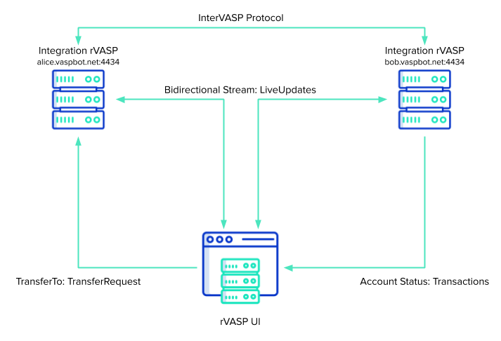

# rVASP

**Robot VASP for TRISA demonstration and integration**

This is a simple gRPC server that implements a UI workflow and messaging framework to demonstrate sending and receiving transactions using the TRISA InterVASP protocol. The server was built to support a demonstration UI that requires a streaming interface so that a live message flow is achieved. However, the communication protocol between rVASPs also demonstrates how implementers might go about writing InterVASP services in their own codebases. The architecture is as follows:

## Generating Protocol Buffers

To regenerate the Go code from the protocol buffers:

$ go generate ./...
